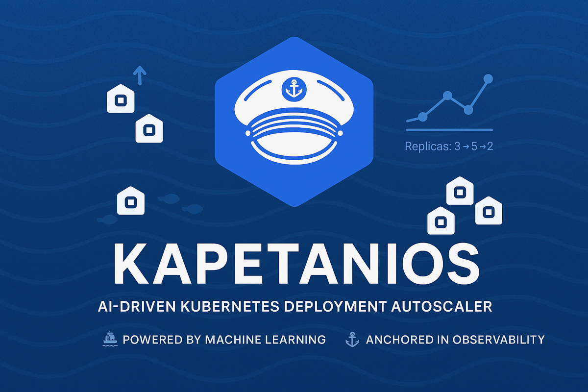
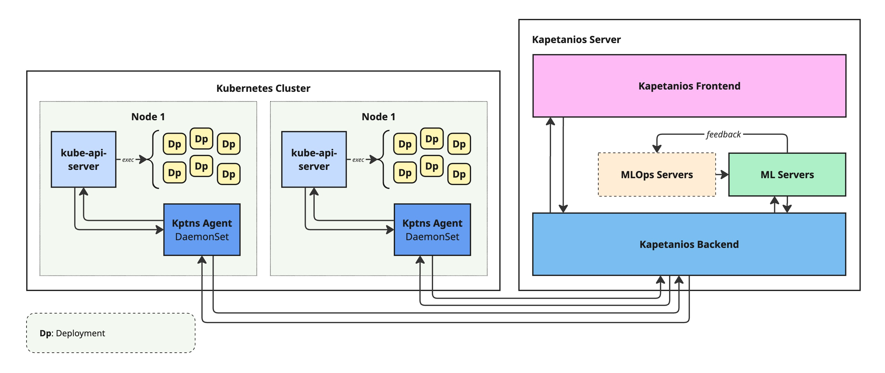

# Kapetanios 🚀  
Welcome to **Kapetanios**! 🌊⚓  
Your ultimate co-pilot for intelligent systems and complex workflows. Currently, Kapetanios leverages an **AI Agent** to intelligently manage the scaling of replicas for each Deployment, ensuring efficiency and responsiveness in Kubernetes environments.

> **Inspired by visionary captains navigating uncharted waters**, Kapetanios is designed to optimize and streamline deployment strategies with modern tools and scalable approaches.

⚠️ **Note:** This is an early-stage prototype and is currently under active development. Features may change, and contributions or feedback are welcome!

## 🌟 Key Features
- **Smart Scaling:** Dynamically adjusts the number of replicas for each Deployment based on real-time data.  
- **AI Agent-Driven:** Ensures optimal resource allocation and system performance.  
- **Kubernetes-Ready:** Seamlessly integrates with Kubernetes to enhance container orchestration.  

**Kapetanios** is just getting started—join us as we continue to expand its capabilities and chart new horizons! 🌐

## 🖥️ System Design
The system employs an agent running on each node as a DaemonSet for the collection and transmission of Deployment metrics, as well as for managing the number of replicas for each Deployment according to the configuration. An external application is responsible for data management and the training of machine learning models, which power the core functionality of Kapetanios.

*Figura 1: Kapetanios system design.*
